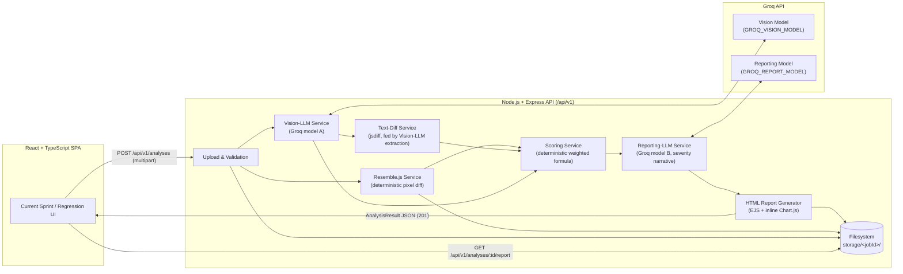

# Architecture.md — Visual Regression Testing Tool

**Status:** Final — implementation-ready
**Audience:** Any coding agent (Claude, GitHub Copilot, Cursor, or any IDE-integrated LLM) implementing this system from scratch, with zero further clarification required.

---

## 1. Overview & Goals

A manually-driven visual QA tool that lets a user upload screenshot(s) and get an automated analysis:

- **New Feature/Page** (no baseline exists yet): a single image is checked by a Vision-LLM against a fixed UI-quality checklist.
- **Regression** (an existing feature/page): a baseline image and a current image are compared using one of three selectable modes — pixel-by-pixel, text-extraction diff, or hybrid.

Every run produces a numeric severity score and a downloadable, self-contained HTML report (table + pie chart). There is no browser automation anywhere in this system — the user supplies images manually via file upload.

**In scope:** image upload, deterministic pixel diffing, LLM-based visual/text analysis, scoring, HTML report generation, a two-path web UI.
**Out of scope:** screenshot capture/automation, multi-user accounts, CI/CD integration, cloud storage.

**Intended user:** a single QA engineer running one analysis at a time from a local browser session.

---

## 2. Tech Stack Summary

| Layer | Technology | Notes |
|---|---|---|
| Frontend | React 18 + TypeScript | Vite build tooling |
| Frontend routing/state | React Router v6 + Context API + `useReducer` | No Redux/Zustand — state surface is small |
| Backend | Node.js 18+ + Express | Plain JavaScript, ES modules (no backend TypeScript compile step) |
| Pixel diff | Resemble.js | Deterministic library — never an LLM, no exceptions |
| Vision/text analysis LLM | Groq-hosted vision model | Configurable via `.env`, called via Groq's OpenAI-compatible Chat Completions API with JSON mode |
| Reporting/severity LLM | Groq-hosted model, **different from the vision model** | Configurable via `.env` |
| HTTP client (frontend) | native `fetch` | Wrapped in a thin API client module |
| File uploads | `multer` (memory/disk storage under `STORAGE_DIR`) | |
| Report templating | EJS | Rendered server-side to a single static HTML file |
| Report charting | Chart.js (UMD build), inlined into the report `<script>` tag | No CDN reference — report must work fully offline |
| Job/history persistence | Filesystem JSON (`metadata.json` per job) | No database server |
| Env loading | `dotenv` | Flat, prefix-namespaced keys |

Rationale for each choice is recorded next to the corresponding decision in the sections below; all choices trace back to explicit answers gathered during requirements elicitation.

---

## 3. System Architecture Diagram



---

## 4. Functional Requirements & User Flows

### 4.1 Top-level navigation

Two top-level routes, both always visible in the nav (each independently toggleable via `.env` — see §5):

- **Current Sprint** (`/current-sprint`) → New Feature/Page flow
- **Regression** (`/regression`) → Existing Feature/Page flow

### 4.2 Current Sprint (New Feature/Page) flow

1. User uploads **one** image (PNG/JPEG, ≤ `MAX_UPLOAD_SIZE_MB`).
2. Frontend calls `POST /api/v1/analyses` with `mode=new-feature`.
3. Backend sends the image to the **Vision-LLM** with a checklist prompt covering exactly: **layout, alignment, text, spacing, colour, missing/extra elements**.
4. Backend runs the Scoring Service (LLM findings only, no pixel term) and the Reporting-LLM to produce severity narrative.
5. Backend generates the HTML report and returns the full `AnalysisResult` JSON, including a `reportUrl`.
6. Frontend renders a results view (score badge, findings table, pie chart preview) with a "Download HTML Report" button.

### 4.3 Regression (Existing Feature/Page) flow

1. User uploads **two** images: baseline + current (PNG/JPEG, ≤ `MAX_UPLOAD_SIZE_MB` each).
2. User selects one sub-mode (each independently toggleable via `.env`):
   - **Pixel-by-pixel** — Resemble.js only.
   - **Text-extraction diff** — Vision-LLM extracts text from both images; `jsdiff` diffs the two text blocks.
   - **Hybrid** — both of the above, findings merged.
3. Frontend calls `POST /api/v1/analyses` with `mode=regression`, `subMode=pixel|text|hybrid`.
4. Backend runs the selected engine(s) — pixel diff is **always** Resemble.js, never an LLM, in every sub-mode that includes it.
5. Scoring Service combines pixel-mismatch % (if present) and LLM/text findings into one numeric score via the weighted formula (§11).
6. Reporting-LLM (a model distinct from the vision model) produces the severity narrative; HTML report is generated.
7. Frontend renders the same results view as §4.2, plus a side-by-side baseline/current/diff image viewer.

---

## 5. `.env` Configuration Reference

Every menu option, sub-menu option, model choice, and threshold is defined here — nothing in the codebase may hardcode these values. A committed `.env.example` mirrors this table with the defaults shown.

### Server

| Variable | Type | Default | Description |
|---|---|---|---|
| `PORT` | number | `4000` | Express server port |
| `NODE_ENV` | string | `development` | `development` \| `production` |
| `API_BASE_PATH` | string | `/api/v1` | Base path prefix for all routes |
| `CORS_ORIGIN` | string | `http://localhost:5173` | Allowed frontend origin |

### Storage

| Variable | Type | Default | Description |
|---|---|---|---|
| `STORAGE_DIR` | string | `./storage` | Root directory for job folders (images, diffs, reports, metadata) |
| `MAX_UPLOAD_SIZE_MB` | number | `10` | Max size per uploaded file, in MB |
| `ALLOWED_IMAGE_TYPES` | string (CSV) | `image/png,image/jpeg` | Accepted MIME types |

### Feature toggles (menu / sub-menu)

| Variable | Type | Default | Description |
|---|---|---|---|
| `FEATURE_ENABLE_NEW_FEATURE_MODE` | boolean | `true` | Show/enable "Current Sprint" path |
| `FEATURE_ENABLE_REGRESSION_MODE` | boolean | `true` | Show/enable "Regression" path |
| `FEATURE_ENABLE_PIXEL_SUBMODE` | boolean | `true` | Enable pixel-by-pixel sub-mode |
| `FEATURE_ENABLE_TEXT_SUBMODE` | boolean | `true` | Enable text-extraction-diff sub-mode |
| `FEATURE_ENABLE_HYBRID_SUBMODE` | boolean | `true` | Enable hybrid sub-mode |

A disabled top-level mode returns `403 FEATURE_DISABLED` if called directly via the API; the frontend hides the corresponding nav entry/sub-mode option by reading `GET /api/v1/config` (§6.6).

### Groq model configuration

| Variable | Type | Default | Description |
|---|---|---|---|
| `GROQ_API_KEY` | string | *(required, no default)* | Groq API key |
| `GROQ_API_BASE_URL` | string | `https://api.groq.com/openai/v1` | Groq OpenAI-compatible base URL |
| `GROQ_VISION_MODEL` | string | `llama-3.2-90b-vision-preview` | Model used for layout/text/vision analysis. **Must support image input.** |
| `GROQ_REPORT_MODEL` | string | `llama-3.3-70b-versatile` | Model used for severity narrative/reporting. **Must differ from `GROQ_VISION_MODEL`.** |
| `GROQ_VISION_TEMPERATURE` | number | `0.2` | Sampling temperature for the vision model |
| `GROQ_REPORT_TEMPERATURE` | number | `0.2` | Sampling temperature for the reporting model |
| `GROQ_REQUEST_TIMEOUT_MS` | number | `60000` | Per-request timeout |
| `GROQ_MAX_RETRIES` | number | `2` | Retry attempts on transient Groq API failures (exponential backoff) |

At server startup, fail fast with a clear error if `GROQ_VISION_MODEL === GROQ_REPORT_MODEL` (violates mandate #6).

### Resemble.js

| Variable | Type | Default | Description |
|---|---|---|---|
| `RESEMBLE_MISMATCH_THRESHOLD` | number (%) | `5` | Max allowed mismatch percentage for a pixel-diff "pass" |

### Scoring & severity

| Variable | Type | Default | Description |
|---|---|---|---|
| `SCORE_WEIGHT_PIXEL` | number | `0.6` | Weight applied to the pixel-mismatch term |
| `SCORE_WEIGHT_LLM` | number | `0.4` | Weight applied to the LLM-findings penalty term |
| `SCORE_PENALTY_LOW` | number | `2` | Penalty points per `low`-severity finding |
| `SCORE_PENALTY_MEDIUM` | number | `5` | Penalty points per `medium`-severity finding |
| `SCORE_PENALTY_HIGH` | number | `10` | Penalty points per `high`-severity finding |
| `SEVERITY_BAND_PASSED_MIN` | number | `90` | Score ≥ this → `Passed` |
| `SEVERITY_BAND_MINOR_MIN` | number | `75` | Score ≥ this (and < Passed) → `Minor` |
| `SEVERITY_BAND_MAJOR_MIN` | number | `50` | Score ≥ this (and < Minor) → `Major`; below → `Critical` |

### Report generation

| Variable | Type | Default | Description |
|---|---|---|---|
| `REPORT_TITLE` | string | `Visual Regression Report` | Title shown in the generated HTML report |
| `REPORT_DATE_FORMAT` | string | `YYYY-MM-DD HH:mm` | Timestamp format used in the report |

---

## 6. REST API Specification

**Base path:** `API_BASE_PATH` (default `/api/v1`). All request/response bodies are JSON except the upload endpoint (`multipart/form-data`) and the report-download endpoint (`text/html`).

### 6.1 Versioning & conventions

- URL path versioning: `/api/v1/...`. A breaking change ships as `/api/v2/...` alongside `v1` until deprecated.
- Resource-oriented nouns, plural resource names, standard HTTP verbs/status codes.
- All error responses use the envelope in §6.5, generated by centralized Express error middleware — no endpoint hand-rolls its own error shape.
- No authentication (single-user local tool, per requirements). Requests are processed **synchronously and sequentially** — no job queue, no polling.

### 6.2 `POST /api/v1/analyses`

Creates and immediately runs an analysis. Synchronous: the full pipeline (upload validation → pixel diff and/or vision LLM → scoring → reporting LLM → HTML report generation) executes within this single request/response cycle.

**Request:** `multipart/form-data`

| Field | Type | Required | Notes |
|---|---|---|---|
| `mode` | string | yes | `new-feature` \| `regression` |
| `subMode` | string | only if `mode=regression` | `pixel` \| `text` \| `hybrid` |
| `image` | file | only if `mode=new-feature` | Single image |
| `baselineImage` | file | only if `mode=regression` | Baseline screenshot |
| `currentImage` | file | only if `mode=regression` | Current screenshot |

**Success response:** `201 Created`

```json
{
  "success": true,
  "data": {
    "jobId": "b3f1c2d4-...-uuid",
    "mode": "regression",
    "subMode": "hybrid",
    "createdAt": "2026-07-12T10:15:00.000Z",
    "images": {
      "baseline": "/api/v1/analyses/b3f1c2d4/images/baseline",
      "current": "/api/v1/analyses/b3f1c2d4/images/current",
      "diff": "/api/v1/analyses/b3f1c2d4/images/diff"
    },
    "findings": [
      {
        "id": "f1",
        "category": "spacing",
        "description": "Card padding reduced from 16px to 8px on the current page.",
        "severity": "medium",
        "location": { "x": 120, "y": 340, "width": 240, "height": 80 }
      }
    ],
    "pixelDiff": {
      "mismatchPercentage": 4.7,
      "passed": true
    },
    "textDiff": {
      "additions": ["New badge text: \"Beta\""],
      "deletions": [],
      "diffSummary": "1 addition, 0 deletions detected."
    },
    "score": {
      "numericScore": 87,
      "severity": "Minor",
      "breakdown": { "pixelContribution": 2.82, "llmContribution": 2.0 }
    },
    "reportUrl": "/api/v1/analyses/b3f1c2d4/report"
  }
}
```

**Error responses:** `400 VALIDATION_ERROR`, `413 FILE_TOO_LARGE`, `415 UNSUPPORTED_MEDIA_TYPE`, `403 FEATURE_DISABLED`, `502 GROQ_API_ERROR`, `500 INTERNAL_ERROR`.

### 6.3 `GET /api/v1/analyses`

Lists past jobs (read from `storage/*/metadata.json`).

Query params: `?mode=regression&limit=20&offset=0`

**Success:** `200 OK` → `{ "success": true, "data": { "items": [ /* AnalysisResult summaries */ ], "total": 42 } }`

### 6.4 `GET /api/v1/analyses/:id`

Returns the stored `AnalysisResult` for one job.

**Success:** `200 OK` with the same shape as §6.2's `data`.
**Error:** `404 JOB_NOT_FOUND`.

### 6.5 `GET /api/v1/analyses/:id/report`

Streams the self-contained HTML report file for download.

**Success:** `200 OK`, `Content-Type: text/html`, `Content-Disposition: attachment; filename="report-<jobId>.html"`.
**Error:** `404 JOB_NOT_FOUND` (JSON envelope).

### 6.6 `GET /api/v1/config`

Returns the current feature-toggle state so the frontend can hide disabled menu/sub-menu options without hardcoding them.

```json
{
  "success": true,
  "data": {
    "newFeatureModeEnabled": true,
    "regressionModeEnabled": true,
    "pixelSubModeEnabled": true,
    "textSubModeEnabled": true,
    "hybridSubModeEnabled": true,
    "maxUploadSizeMb": 10,
    "allowedImageTypes": ["image/png", "image/jpeg"]
  }
}
```

### 6.7 `GET /api/v1/health`

Liveness check. `200 OK` → `{ "success": true, "data": { "status": "ok" } }`.

### 6.8 Error envelope (all endpoints)

```json
{
  "success": false,
  "error": {
    "code": "VALIDATION_ERROR",
    "message": "Human-readable description of what went wrong.",
    "details": { "field": "image", "reason": "Unsupported MIME type: image/gif" }
  }
}
```

| HTTP status | `code` | Meaning |
|---|---|---|
| 400 | `VALIDATION_ERROR` | Missing/invalid request fields |
| 403 | `FEATURE_DISABLED` | Requested mode/sub-mode is disabled via `.env` |
| 404 | `JOB_NOT_FOUND` | No job with the given `id` |
| 413 | `FILE_TOO_LARGE` | Upload exceeds `MAX_UPLOAD_SIZE_MB` |
| 415 | `UNSUPPORTED_MEDIA_TYPE` | MIME type not in `ALLOWED_IMAGE_TYPES` |
| 422 | `LLM_RESPONSE_INVALID` | Groq response failed schema validation after all retries |
| 502 | `GROQ_API_ERROR` | Upstream Groq API failure after all retries |
| 500 | `INTERNAL_ERROR` | Unhandled server error |

---

## 7. Data Models

Canonical TypeScript interfaces (mirrored 1:1 in `client/src/types/index.ts`; the backend, being plain JavaScript, treats this section as the authoritative JSON contract for every response body it produces).

```typescript
type AnalysisMode = 'new-feature' | 'regression';
type RegressionSubMode = 'pixel' | 'text' | 'hybrid';
type Severity = 'Passed' | 'Minor' | 'Major' | 'Critical';
type FindingSeverity = 'low' | 'medium' | 'high';
type FindingCategory =
  | 'layout' | 'alignment' | 'text' | 'spacing' | 'colour'
  | 'missing-element' | 'extra-element';

interface Finding {
  id: string;
  category: FindingCategory;
  description: string;
  severity: FindingSeverity;
  location?: { x: number; y: number; width: number; height: number };
}

interface PixelDiffResult {
  mismatchPercentage: number;
  passed: boolean;
}

interface TextDiffResult {
  additions: string[];
  deletions: string[];
  diffSummary: string;
}

interface ScoreResult {
  numericScore: number;      // 0-100, 100 = perfect match
  severity: Severity;
  breakdown: {
    pixelContribution?: number;
    llmContribution?: number;
  };
}

interface AnalysisResult {
  jobId: string;
  mode: AnalysisMode;
  subMode?: RegressionSubMode;
  createdAt: string;          // ISO 8601
  images: {
    single?: string;
    baseline?: string;
    current?: string;
    diff?: string;
  };
  findings: Finding[];
  pixelDiff?: PixelDiffResult;
  textDiff?: TextDiffResult;
  score: ScoreResult;
  reportUrl: string;
}
```

Each `AnalysisResult` is persisted verbatim as `storage/<jobId>/metadata.json`.

---

## 8. Backend Architecture

```
server/
  src/
    index.js                    # process entrypoint
    app.js                      # express app, middleware wiring
    config/
      env.js                    # loads + validates .env (fails fast on invalid config)
    routes/
      v1/
        analyses.routes.js
        config.routes.js
        health.routes.js
    controllers/
      analyses.controller.js    # orchestrates the pipeline per request
    services/
      storage.service.js        # job folder create/read/list (storage/<jobId>/...)
      resemble.service.js       # wraps Resemble.js, applies RESEMBLE_MISMATCH_THRESHOLD
      visionLLM.service.js      # Groq vision-model calls (checklist + text extraction), JSON-mode
      textDiff.service.js       # jsdiff over two extracted text blocks
      scoring.service.js        # weighted formula + severity banding (§11)
      reportingLLM.service.js   # Groq reporting-model call for severity narrative
      report.service.js         # EJS render + inline Chart.js -> report.html
    middleware/
      upload.middleware.js      # multer config (size/type limits from .env)
      errorHandler.js           # centralized error envelope (§6.8)
      validateAnalysisRequest.js
    templates/
      report.ejs
      chart.umd.min.js          # vendored, inlined at render time — no CDN
    utils/
      idGenerator.js            # uuid job IDs
      logger.js
      groqClient.js             # shared fetch wrapper: base URL, timeout, retries
  storage/                      # gitignored — runtime job data
  .env.example
  package.json
```

Request flow inside `analyses.controller.js`:
1. `upload.middleware.js` validates/saves files into `storage/<jobId>/`.
2. Branch on `mode`/`subMode` to call `resemble.service`, `visionLLM.service`, and/or `textDiff.service`.
3. `scoring.service` combines outputs into a `ScoreResult`.
4. `reportingLLM.service` (using `GROQ_REPORT_MODEL`) turns findings + score into a short narrative for the report.
5. `report.service` renders `report.ejs` to `storage/<jobId>/report.html`.
6. `storage.service` writes `metadata.json`; controller returns the `AnalysisResult`.

---

## 9. Comparison Engine Details

### 9.1 New Feature/Page (Vision-LLM only)

Single Groq vision-model call with the uploaded image, prompted to return JSON findings strictly limited to these six checklist categories: **layout, alignment, text, spacing, colour, missing/extra elements**. No pixel diff is run (no baseline exists). `pixelDiff` is omitted from the result; `score.breakdown.pixelContribution` is omitted.

### 9.2 Regression — Pixel-by-pixel

`resemble.service.js` calls Resemble.js's `compare(baselineBuffer, currentBuffer)`, producing a `mismatchPercentage` and a diff image saved to `storage/<jobId>/diff.png`. `passed = mismatchPercentage <= RESEMBLE_MISMATCH_THRESHOLD`. This engine is **always** the deterministic library — it is never routed through an LLM, in this or any other sub-mode.

### 9.3 Regression — Text-extraction diff

`visionLLM.service.js` calls the vision model twice (once per image) with an extraction-only prompt, returning plain extracted text per image. `textDiff.service.js` runs `jsdiff.diffWords` (or `diffLines`) on the two blocks to compute `additions`/`deletions`, then summarizes into `diffSummary`.

### 9.4 Regression — Hybrid

Runs 9.2 and 9.3 in sequence (pixel diff first, then text diff), merges both `findings` arrays (vision-derived findings from the text pass, e.g., a "text" or "missing-element" finding, sit alongside the raw pixel-mismatch number), and feeds both into the scoring formula (§11) using both weight terms.

---

## 10. AI Model Integration

### 10.1 Groq client

`utils/groqClient.js` wraps Groq's OpenAI-compatible endpoint:

```
POST {GROQ_API_BASE_URL}/chat/completions
Authorization: Bearer {GROQ_API_KEY}
Content-Type: application/json
```

Shared wrapper applies `GROQ_REQUEST_TIMEOUT_MS`, retries up to `GROQ_MAX_RETRIES` times with exponential backoff on 429/5xx, and throws a typed error consumed by `errorHandler.js` to produce `502 GROQ_API_ERROR`.

### 10.2 Vision-model call (checklist / New Feature)

```json
{
  "model": "{GROQ_VISION_MODEL}",
  "temperature": "{GROQ_VISION_TEMPERATURE}",
  "response_format": { "type": "json_object" },
  "messages": [
    { "role": "system", "content": "You are a meticulous UI QA reviewer. Analyze the supplied screenshot against exactly these six categories: layout, alignment, text, spacing, colour, missing/extra elements. Respond with JSON only, matching the given schema." },
    { "role": "user", "content": [
      { "type": "text", "text": "Return findings as: { \"findings\": [{ \"category\": ..., \"description\": ..., \"severity\": \"low|medium|high\", \"location\": {x,y,width,height} | null }] }" },
      { "type": "image_url", "image_url": { "url": "data:image/png;base64,<...>" } }
    ]}
  ]
}
```

Response is parsed and validated against the `Finding[]` schema (§7); a validation failure triggers a single re-prompt with the validation error appended, then `422 LLM_RESPONSE_INVALID` if it still fails.

### 10.3 Vision-model call (text extraction, used by 9.3/9.4)

Same shape as 10.2, but the system prompt instructs pure OCR-style text extraction (`{ "extractedText": "..." }`), no findings.

### 10.4 Reporting-model call (severity narrative)

```json
{
  "model": "{GROQ_REPORT_MODEL}",
  "temperature": "{GROQ_REPORT_TEMPERATURE}",
  "response_format": { "type": "json_object" },
  "messages": [
    { "role": "system", "content": "You write a concise (2-4 sentence) QA severity summary given a numeric score, severity band, and a list of findings. Respond as JSON: { \"summary\": \"...\" }. Do not recompute the score." },
    { "role": "user", "content": "{ \"score\": 87, \"severity\": \"Minor\", \"findings\": [...] }" }
  ]
}
```

The reporting model **never** computes the numeric score itself — §11's deterministic formula is the sole source of truth for `numericScore`/`severity`; the model only produces the narrative text embedded in the report.

### 10.5 Model-swap mechanics

Both model identifiers are read once at startup from `GROQ_VISION_MODEL` / `GROQ_REPORT_MODEL` (env.js fails fast if they're equal or missing). Swapping either model requires only an `.env` change — no code change.

---

## 11. Scoring & Severity Model

**Formula** (all weights/penalties configurable via §5):

```
pixelTerm = pixelDiff ? (pixelDiff.mismatchPercentage × SCORE_WEIGHT_PIXEL) : 0

llmPenalty = Σ over findings of penaltyFor(finding.severity)
  where penaltyFor(low) = SCORE_PENALTY_LOW
        penaltyFor(medium) = SCORE_PENALTY_MEDIUM
        penaltyFor(high) = SCORE_PENALTY_HIGH

llmTerm = llmPenalty × SCORE_WEIGHT_LLM

numericScore = clamp(100 - pixelTerm - llmTerm, 0, 100)
```

**Severity banding** (defaults from §5):

| Score range | Severity |
|---|---|
| ≥ `SEVERITY_BAND_PASSED_MIN` (90) | Passed |
| ≥ `SEVERITY_BAND_MINOR_MIN` (75) and < 90 | Minor |
| ≥ `SEVERITY_BAND_MAJOR_MIN` (50) and < 75 | Major |
| < 50 | Critical |

**Worked example** (Regression, hybrid mode, default weights):
- `pixelDiff.mismatchPercentage = 8`
- Findings: 2 × `medium`, 1 × `high`

```
pixelTerm = 8 × 0.6 = 4.8
llmPenalty = (5 + 5 + 10) = 20
llmTerm = 20 × 0.4 = 8.0
numericScore = 100 - 4.8 - 8.0 = 87.2 → rounded to 87
severity = 87 is >= 75 and < 90 → "Minor"
```

For New Feature mode, `pixelTerm` is always `0` (no baseline/pixel diff exists) and only the LLM term applies.

---

## 12. Report Generation

- Template: `server/src/templates/report.ejs`, rendered server-side per job into `storage/<jobId>/report.html`.
- The report **must be a single, self-contained file** that opens correctly with no network access: `chart.umd.min.js` (vendored from the `chart.js` npm package) is read from disk and inlined inside a `<script>` tag at render time; all CSS is inlined in a `<style>` tag.
- **Contents (both New Feature and Regression flows produce this same structure):**
  - Header: `REPORT_TITLE`, job ID, timestamp (`REPORT_DATE_FORMAT`), mode/sub-mode.
  - Score summary: numeric score, severity badge, reporting-model narrative (§10.4).
  - **Findings table:** columns `Category | Description | Severity | Location`.
  - **Pie chart:** findings grouped by `severity` (low/medium/high counts), rendered via inlined Chart.js into a `<canvas>`.
  - Image panel: for Regression, baseline/current/diff images embedded as base64 `` tags (no external file references, keeping the report portable); for New Feature, the single uploaded image.
- Download: `GET /api/v1/analyses/:id/report` streams this file with `Content-Disposition: attachment`.

---

## 13. Frontend Architecture

```
client/
  src/
    main.tsx
    App.tsx                     # <BrowserRouter> + route table
    routes/
      CurrentSprintPage.tsx     # New Feature flow (single upload)
      RegressionPage.tsx        # Regression flow (baseline+current upload, sub-mode selector)
    components/
      ImageUploader.tsx
      SubModeSelector.tsx
      ResultView.tsx            # score badge + findings table + pie chart preview + download button
      FindingsTable.tsx
      ScoreBadge.tsx
    context/
      AppContext.tsx            # createContext + Provider
      appReducer.ts             # useReducer: { status, currentJob, error }
    api/
      client.ts                 # fetch wrapper, base URL, error envelope unwrapping
      analyses.ts                # postAnalysis(), getAnalysis(), getConfig()
    types/
      index.ts                  # mirrors §7 interfaces
    styles/
  public/
  index.html
  package.json
  tsconfig.json
```

- **Routing:** React Router v6 maps `/current-sprint` → `CurrentSprintPage`, `/regression` → `RegressionPage`. Both routes are conditionally rendered/hidden in the nav based on `GET /api/v1/config` (§6.6).
- **State:** `AppContext` + `useReducer` holds the in-flight job status (`idle | uploading | processing | done | error`), the current `AnalysisResult`, and any error. No external state library.
- **API client:** `api/client.ts` centralizes error-envelope unwrapping (§6.8) so components only handle `{data}` or a typed `ApiError`.

---

## 14. Error Handling & Validation Conventions

- All errors flow through a single Express error-handling middleware (`middleware/errorHandler.js`) producing the envelope in §6.8 — no route handler writes its own error JSON.
- Upload validation (`upload.middleware.js`, backed by `multer`) enforces `MAX_UPLOAD_SIZE_MB` and `ALLOWED_IMAGE_TYPES` before any file reaches a service.
- Request-shape validation (`validateAnalysisRequest.js`) checks `mode`/`subMode`/file-count combinations before the controller runs the pipeline, returning `400 VALIDATION_ERROR` with a `details.field` pointer.
- Frontend never shows raw error objects — it maps `error.code` to a user-facing message via a static lookup table.

---

## 15. Non-Functional Requirements

- **Performance:** single synchronous request end-to-end; acceptable latency budget is dominated by Groq round-trips (~5-20s per call). Frontend sets a generous client-side timeout (≥ `GROQ_REQUEST_TIMEOUT_MS × 2` to allow for internal retries) and shows a processing spinner.
- **Security posture:** no authentication (explicit local single-user tool decision); `GROQ_API_KEY` lives only in server-side `.env`, never sent to the client; CORS restricted to `CORS_ORIGIN`.
- **Concurrency:** no job queue — the server processes one request at a time per the synchronous execution model; this is a deliberate simplicity trade-off for a single-user tool, not a scalability target.
- **Logging/observability:** structured request/response logging (`utils/logger.js`) including `jobId`, mode/subMode, Groq call durations, and final score — written to stdout (no external log aggregation required).
- **Portability:** all persisted artifacts and the generated report are plain files under `STORAGE_DIR`; no database server, no cloud dependency, offline-capable reports.

---

## 16. Project/Folder Structure

```
Visual_Regression_Implementation/
  Architecture.md
  prompt-for-architecture.md
  package.json                  # root: "dev" script runs client+server via `concurrently`
  server/
    src/                         # see §8
    storage/                     # gitignored
    .env.example
    package.json
  client/
    src/                         # see §13
    public/
    package.json
    tsconfig.json
    vite.config.ts
```

---

## 17. Setup & Run Instructions

**Prerequisites:** Node.js 18+, npm, a Groq API key.

```bash
# 1. Install dependencies
npm install --prefix server
npm install --prefix client

# 2. Configure environment
cp server/.env.example server/.env
# edit server/.env: set GROQ_API_KEY, confirm GROQ_VISION_MODEL != GROQ_REPORT_MODEL

# 3. Run in development (two processes)
npm run dev --prefix server     # starts Express on PORT (default 4000)
npm run dev --prefix client     # starts Vite on 5173, proxies /api to the server

# 4. Production build
npm run build --prefix client   # outputs client/dist
npm start --prefix server       # serves the API (and optionally client/dist as static files)
```

`server/.env.example` must contain every variable from §5 with its documented default, so the project runs out-of-the-box aside from supplying `GROQ_API_KEY`.

---

## 18. Appendix

### 18.1 Example: New Feature request/response

Request: `POST /api/v1/analyses`, `multipart/form-data`, `mode=new-feature`, `image=<file>`.

Response `201`:
```json
{
  "success": true,
  "data": {
    "jobId": "9a2e...",
    "mode": "new-feature",
    "createdAt": "2026-07-12T09:00:00.000Z",
    "images": { "single": "/api/v1/analyses/9a2e.../images/single" },
    "findings": [
      { "id": "f1", "category": "colour", "description": "Primary CTA button uses #2266EE instead of design-spec #1A56DB.", "severity": "low" }
    ],
    "score": { "numericScore": 96, "severity": "Passed", "breakdown": { "llmContribution": 0.8 } },
    "reportUrl": "/api/v1/analyses/9a2e.../report"
  }
}
```

### 18.2 Example: validation error

```json
{
  "success": false,
  "error": {
    "code": "VALIDATION_ERROR",
    "message": "Regression mode requires both baselineImage and currentImage.",
    "details": { "field": "currentImage", "reason": "missing" }
  }
}
```

### 18.3 Glossary

- **Job** — one analysis run, identified by `jobId`, persisted under `storage/<jobId>/`.
- **Finding** — a single issue flagged by the vision LLM in one of the six checklist categories.
- **Mismatch percentage** — Resemble.js's raw pixel-difference metric between baseline and current images.
- **Severity band** — one of `Passed | Minor | Major | Critical`, derived from the numeric score via §11.

---

*This document reflects the fixed requirements in `prompt-for-architecture.md` plus 15 architectural decisions gathered via requirements elicitation. Every configurable value referenced above lives in `.env` — no menu option, sub-menu option, model choice, or threshold is hardcoded in source.*
